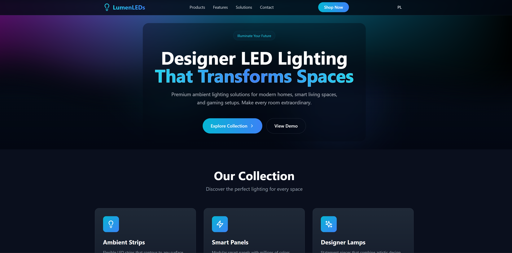

# LumenLEDs

`LumenLEDs` is a simple **landing page** template for a hypothetical
business selling LED lighting products.
The site itself is static but styled and structured in a way that makes it
easy to extend with real data or integrate with a service later on.
The primary goal of the project was to build an enjoyable, UI‑focused
landing page featuring elements such as the aurora effect and
an interactive LED color picker.

## Screenshots

## Technologies

This repository is built with a React/TypeScript frontend toolchain:

- **React** (with TypeScript) for the component layer
- **Vite** as the development/build tool
- **Tailwind CSS** for utility‑first styling
- **ESLint**/TypeScript for linting and type checking
- **ogl** for lightweight WebGL rendering, powering the Aurora shader effect
- Other utilities and libraries such as `gsap`, `radix-ui`,
  `supabase-js` (for future data integration), and CSS animation helpers
